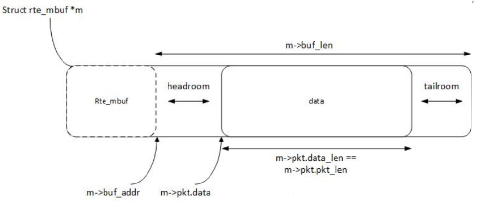
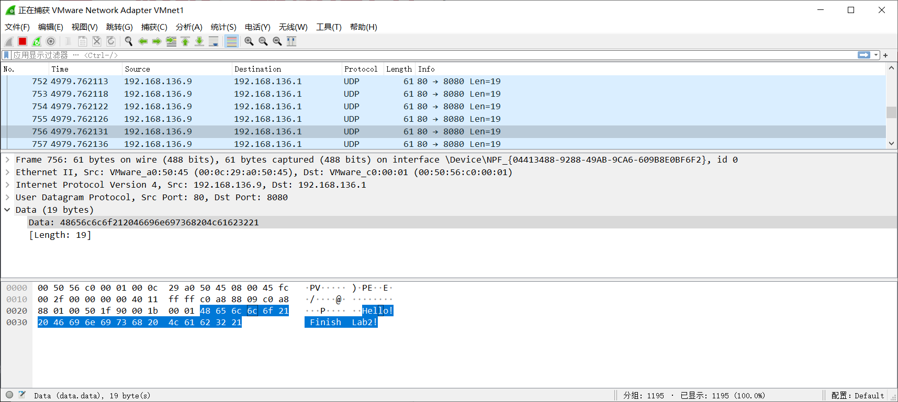

# Lab2

## Part 1: Get familiar with DPDK

### Q1 : What's the purpose of using hugepage?

利用内存大页能有效降低TLB miss


### Q2 : Take examples/helloworld as an example, describe the execution flow of DPDK programs?

#### 1. EAL Initialization

第一步是初始化环境抽象层(Environment Abstraction Layer)

```c
ret = rte_eal_init(argc, argv);
if (ret < 0)
	rte_panic("Cannot init EAL\n");
```

`rte_eal_init`的返回值是解析的参数的数量


#### 2. Starting Application Unit Lcores

若初始化EAL，应用程序可以在每个可用的`lcore`上启动功能。如果初始化失败则报错。

```c
/* call lcore_hello() on every worker lcore */
	RTE_LCORE_FOREACH_WORKER(lcore_id) {
		rte_eal_remote_launch(lcore_hello, NULL, lcore_id);
	}

	/* call it on main lcore too */
	lcore_hello(NULL);
```

在示例中，是在可用的`lcore`上调用`lcore_hello()`：

```c
static int
lcore_hello(__rte_unused void *arg)
{
	unsigned lcore_id;
	lcore_id = rte_lcore_id();
	printf("hello from core %u\n", lcore_id);
	return 0;
}
```


### Q3 : Read the codes of examples/skeleton, describe DPDK APIs related to sending and receiving packets.

**rte_eth_tx_burst**：

```c
static inline uint16_t
rte_eth_tx_burst(uint16_t port_id, uint16_t queue_id,
		 struct rte_mbuf **tx_pkts, uint16_t nb_pkts)
```

* **Send** a burst of output packets on a transmit queue of an Ethernet device
* For each packet to send, the rte_eth_tx_burst() function performs the following operations:
   * Pick up the next available descriptor in the transmit ring.
   * Free the network buffer previously sent with that descriptor, if any.
   * Initialize the transmit descriptor with the information provided in the *rte_mbuf data structure.

**rte_eth_rx_burst**：

```c
static inline uint16_t
rte_eth_rx_burst(uint16_t port_id, uint16_t queue_id,
		 struct rte_mbuf **rx_pkts, const uint16_t nb_pkts)
```

* **Retrieve** a burst of input packets from a receive queue of an Ethernet device. The retrieved packets are stored in *rte_mbuf* structures whose pointers are supplied in the *rx_pkts* array.

* it performs the following operations:
   * Initialize the *rte_mbuf* data structure associated with the RX descriptor according to the information provided by the NIC into that RX descriptor.
   * Store the *rte_mbuf* data structure into the next entry of the *rx_pkts* array.
   * Replenish the RX descriptor with a new *rte_mbuf* buffer allocated from the memory pool associated with the receive queue at initialization time.

**rte_pktmbuf_free**:

```c#
static inline void rte_pktmbuf_free(struct rte_mbuf *m)
```

* **Free** a packet mbuf back into its original mempool.
* The `rte_eth_tx_burst()` function frees the memory buffers of packets that are transmitted. If packets fail to transmit, `(nb_tx < nb_rx)`, then they must be freed explicitly using `rte_pktmbuf_free()`.


#### Q4: Describet he data structure of 'rte_mbuf '



`rte_mbuf`中比较重要的变量：

```c
struct rte_mbuf {
	void *buf_addr; /**< Virtual address of segment buffer. */
	uint16_t data_off;
	uint32_t pkt_len; /**< Total pkt len: sum of all segments. */
	uint16_t data_len; /**< Amount of data in segment buffer. */
	uint16_t buf_len;
    struct rte_mbuf *next;    /**< Next segment of scattered packet. */
	......
}
```

`rte_mbuf`中主要分为三个部分：

* 指针`next` ：指向下一个`rte_mbuf`
* `headroom` :  一般用来存放用户自己针对于mbuf的一些描述信息，一般保留给用户使用，可以通过修改mbuf头文件，来实现headroom的大小
* 数据`data`：地址区间在 `buf_addr + data_off` 到 `buf_add + data_off + data_len`，用于存放数据
* `tailroom` ：一般指的是，data_len还未包含的东西

## Part 2 : send packets with DPDK



**正确性证明**：

由上图可知，通过`VMnet1`正常捕获了来自虚拟机内部的`UDP`包

```c
strcpy(data, "Hello! Finish Lab2!");

struct rte_ether_addr s_addr = {{0x00, 0x0c, 0x29, 0xa0, 0x50, 0x45}};
struct rte_ether_addr d_addr = {{0x00, 0x50, 0x56, 0xc0, 0x00, 0x01}};

form_ether_hdr(eth_hdr, s_addr, d_addr, RTE_ETHER_TYPE_IPV4);
form_ip_hdr(ip_hdr, RTE_IPV4_VHL_DEF, RTE_IPV4_HDR_DSCP_MASK, 28+strlen(data), 0, 0, 64, 17, rte_ipv4_cksum(ip_hdr), RTE_IPV4(192,168,136,9),RTE_IPV4(192,168,136,1));
form_udp_hdr(udp_hdr, 80, 8080, 8+strlen(data), 1);

		
bufs[i]->data_len = sizeof(struct rte_ether_hdr) + sizeof(struct rte_ipv4_hdr) + sizeof(struct rte_udp_hdr) + strlen(data);
bufs[i]->pkt_len = sizeof(struct rte_ether_hdr) + sizeof(struct rte_ipv4_hdr) + sizeof(struct rte_udp_hdr) + strlen(data);
```

由代码片段可以看到，发送`UDP`包的时候：

* 包的内容写为`Hello! Finish Lab2!`，根据`Wireshark`捕获的包的截图可以看到，内容确实相同
* 包的源和目的IP地址也与写入的一致
* 包的MAC地址也与写入的一致

由此可以证明程序的正确性

**操作**：

```bash
$ sudo ninjia install
$ cd example
$ sudo ./dpdk-lab2
```

**NOTE**:

* `next_proto_id `:需要设为 `17` 表示是`UDP`包
* `time_to_live` : 查询得到设为`64`比较合适
* 大小端：写入包头的时候需要使用`rte_cpu_to_be_16`系列函数进行大小端转换
* `ether_type`:需要设为`RTE_ETHER_TYPE_IPV4`表示是`IPV4`包