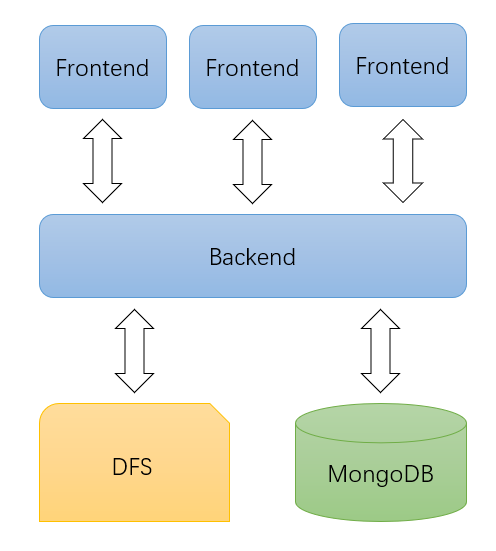

# GDoc 设计说明

gDoc是基于分布式文件系统的在线共享文档编辑应用。我们的gDoc主要实现了网页端协同编辑电子表格的功能，多个用户可以在网页端共同编辑同一个电子表格文件。本文档首先简要介绍了目前gDoc应用已经实现的功能，然后对系统整体架构和前后端框架进行了概述，之后针对本应用的各项功能特性，详细展示我们的实现方案和策略，最后总结了目前系统仍然存在的不足和待改进之处，并对未来可能的工作进行了展望。

- [GDoc 设计说明](#gdoc-设计说明)
  - [应用功能](#应用功能)
  - [系统架构](#系统架构)
    - [整体架构](#整体架构)
    - [前端](#前端)
    - [后端架构](#后端架构)
  - [详细设计](#详细设计)
    - [协同编辑](#协同编辑)
    - [持久化](#持久化)
    - [一致性与同步](#一致性与同步)
    - [回收站](#回收站)
    - [插入图片](#插入图片)
    - [日志系统](#日志系统)
    - [版本回滚](#版本回滚)
  - [未来的工作](#未来的工作)
    - [更多功能](#更多功能)
    - [可扩展性](#可扩展性)

## 应用功能

- 用户可以输入用户名登录系统，登录后可以看到系统中所有可进行共享编辑的电子表格文件。
- 用户可以打开文件进行编辑，包括：修改单个单元格的值和格式、同时修改多个单元格的值和格式、修改表格整体样式、调整行列、添加边框、合并单元格等操作。
- 多个用户能够同时对同一文件进行编辑，并且能够看到其他用户选中的区域。
- 多个用户同时编辑同一个单元格时，允许同时编辑，但所有用户所能看到的最终结果会收敛至相同值。
- 用户可以将系统中的某个可编辑的文件移入回收站，用户可以将回收站中的文件彻底删除。
- 用户可以在文件中插入图片。
- 用户可以查看某个文件的编辑日志，日志中以时间顺序显示各用户对文件做出的修改（包括对单元格的值和格式的修改等）。
- 用户可以在查看日志时，将该文件回滚至某条日志对应的版本。

## 系统架构
### 整体架构
本系统采取了前后端分离的架构模型，前后端之间通过websocker和http协议进行通信，后端会与分布式文件系统进行通信以持久化文件操作，此外部署了NoSQL数据库以记录编辑日志等信息。后端服务使用了Nginx进行反向代理。

本系统整体架构图如下。

### 前端

前端服务使用Vue.js框架搭建，主要使用的组件为Luckysheet。Luchysheet是支持共享编辑的电子表格前端组件，包含电子表格的绝大多数功能，基本解决了在前端展示电子表格的需求。同时，Luckysheet可以通过配置UpdateUrl与后端建立websocket连接，能够将用户在网页端的操作自动发送至后端，且能够从后端接收其他用户对表格进行的操作，从而为协同编辑提供支持。

此外，前端还包含登录页面、文件列表页面等，此处不做赘述。

### 后端架构

后端使用beego框架进行搭建，beego框架对RESTful请求提供了很好的支持。后端整体上采取了经典的分层架构，controller层负责解析请求，service层负责对具体的业务逻辑进行处理，持久化层负责将数据持久化到文件系统或数据库中。

根据业务处理逻辑，数据可能会被持久化到文件系统或数据库中，所以分别有db和fs两个模块进行处理。对于数据库和文件系统会分别创建一个client用于处理相关操作。

## 详细设计

### 协同编辑

Luckysheet会与后端建立websocket连接以推送用户操作并更新文件，所以后端需要将前端推送来的信息转发给其他用户。为实现此功能，后端维护了每个建立连接的客户端信息，包括其用户名、文件名等，并创建了名为message,join和leave的三个通道。当websocket连接建立时，会向join通道发送消息；当连接关闭时，会向leave通道发送消息；每当websocket收到客户端发送的消息时，都会将该消息以及该客户端对应的文件名等信息发送到message通道中。开启了单独的go程用以处理上述消息，当收到join通道的消息时，会建立相关客户端对象；当收到leave通道的消息时，会删除相关客户端对象；当收到message通道的消息时，会将对应的操作信息转发给正在对相同文件进行编辑的所用用户。

通过上述设计，用户在网页端做出的操作可以同步至其他用户，实现了共享编辑的功能。

### 持久化

用户对文件做出的修改需要持久化到文件系统中，故需要对文件系统进行读写。首先需要解析前端发送的信息，根据Luckysheet文档，将前端发送的用户操作信息进行分类，根据请求类型不同抽象出不同的结构体，同时将Luckysheet需要用到的数据结构都抽象为结构体。在收到前端信息后，根据操作类型，选择对应的结构体进行unmarshal，从而获得结构化的前端数据信息，并根据该信息进行操作。

由于文件系统提供了根据行列读写单元格的API，所以针对单元格内容的修改只需要在解析出行列号之后调用API写入文件系统即可。但Luckysheet中还可能发生对文件元数据的修改，于是将行列号均为32位无符号整型数最大值的单元格用于存储元数据，这样可以复用文件系统提供的接口并减小开发难度。

通过配置Luckysheet的LoadUrl，可以使前端在每次重新加载时都向后端发送对应的请求以获得全部文件数据，后端在处理该请求时会调用文件系统的Read API，读取全部文件内容返回给前端。

### 一致性与同步

我们设定的最小编辑粒度为单个单元格。当多个用户对同一单元格同时进行编辑时，就会出现一致性问题，不同用户在编辑后看到的内容可能是不同的。所以我们通过锁的方式保证对于一个单元格，每次只能有一个用户在进行修改。具体实现方法是使用双层map的结构对每个文件的每个单元格维护一个互斥锁，在用户修改单元格的信息到达后端后，后端会调用文件系统相关API进行修改，此时后端会先拿该单元格的锁，拿到后再进行修改操作，修改结束后再放锁，从而实现对单元格数据一致性的保证。上一节提到，文件元数据也是存在了某一个单元格中，所以同样的方法也适用于文件元数据。

只有在用户拿到锁并完成持久化修改之后，用户的操作才会被转发给其他用户（包括自己），这样被成功完成的操作就一定会被其他用户收到。但由于网络通信时延的差异，先后发生的修改可能以不同的顺序到达客户端，导致不同用户看到不同的内容。这一点在网络环境中是无法避免的，但这只是用户视角的差异，在文件系统中存储的内容则是一致的，如果用户重新加载，就可以看到相同的内容，从而保证一致性。我们可以设计为某个用户在编辑时其他用户均不能编辑此单元格，但这样的设计会比较严重的影响用户体验，且用户可以看到其他用户选中的区域，这样用户在编辑时应当对自己编辑的内容被其他用户编辑的内容所覆盖具有心理预期，且目前主流的协同办公软件均采取这种设计，所以我们最终使用了这种允许共同编辑的方案。

此外，还有一个场景涉及到同步问题。即当某用户正在对单元格进行修改时，同时有新用户加入或者有用户重新加载页面，这样就会导致新用户读到的数据中没有刚才进行的修改，而刚才完成的修改可能已经转发完毕，从而将永远不能被新用户获取（除非他重新加载页面）。针对这种情况，我们使用读写锁进行同步，即在对拿单元格锁之前先拿该文件读锁，放单元格锁之后放文件读锁，而在读取文件全部数据时要拿文件写锁，这样读取文件全部数据的操作就会阻塞其他所有修改单元格操作，而修改不同单元格操作之间则是不互斥的（均为读锁），从而使得修改单元格数据和读取文件全部数据不能同时发生，保证了用户数据的一致性。

### 回收站

由于文件系统不提供回收站相关API，所以为了实现回收站功能，我们使用NoSQL数据库MongoDB记录一些文件状态信息。每个文件在被创建时，首先会在文件系统中创建，然后会在数据库中记录该文件的文件名并标记为未删除。如果用户将该文件移入回收站，后端会在数据库中将该文件标记为已删除。前端在展示所有文件列表时，也会向后端发送请求读取数据库中的数据以区分已删除文件和未删除文件，回收站中的文件不能进行编辑。

当用户彻底删除回收站中的文件时，后端会首先调用文件系统的删除API以彻底删除该文件，然后将数据库中该文件的记录删除，这样就完成了彻底删除操作。

### 插入图片

Luckysheet自身提供了插入图片的功能，插入图片后，当前文档中所有图片信息均会通过websocket发送至后端，图片信息存储与文件元数据中。由于图片往往数据量较大，所以需要存储的内容也比较多，这就需要底层文件系统为存储大文件提供支持。底层文件系统可以根据数据量选择存储策略，对上层屏蔽这一区别，这样通过调用相同的文件系统API，即可将图片内容写入文件系统。

### 日志系统

为了实现日志系统，后端在处理前端发送来的修改操作时，除了持久化到文件系统中之外，还需要持久化到数据库中。后端会解析前端发送过来的修改信息，将其中的行列、具体修改内容、文件名、用户名等信息进行提取后存储到数据库中，前端可以通过后端提供的API获取某个文件的所有日志信息。

前端获取到日志信息后，会对日志信息内容进行进一步解析，得到用户做出的具体修改，比如值修改、加粗、改变字体、改变颜色等，然后以文本格式展示在页面中，以便用户理解，提升用户体验。

### 版本回滚

为了给用户更高的自由度，我们通过日志系统实现了版本回滚功能，用户可以回滚到编辑日志中任意一条日志所对应的版本。我们采用了反向undo日志的方法来进行回滚，即在记录日志时同时记录了对应单元格编辑前的内容，在用户发出回滚请求后，按照时间顺序，从后往前依次读取日志中记录的旧值并将其写入文件，从而实现回滚。这种实现方案节省了存储全部文件内容的空间，同时也使用户自由度更高，但是也有很明显的弊端，当需要回滚的日志比较多时，撤销日志操作需要大量的时间，产生大量的写文件操作，性能上比较差。通过定时插入检查点可以在一定程度上解决此问题，这也是我们未来工作的一部分。

## 未来的工作

### 更多功能

Luckysheet组件对电子表格绝大多数功能都提供了支持，但由于时间原因，我们只实现了其中的一小部分，许多更加复杂的功能，如整行整列操作、筛选排序操作等需要涉及到更多单元格，在我们目前的锁粒度下实现起来比较困难，且会带来比较大的性能损失。通过实现更多粒度的锁，可能有助于解决这类问题。

此外，虽然我们实现了和表格元数据相关的操作（如合并单元格、边框、图片等），但目前我们的日志系统还没有记录这类日志信息，在回滚时也无法对这类操作进行回滚，记录此类较复杂的信息需要我们对文件日志结构进行进一步改进，以支持功能更全面的日志系统。

### 可扩展性

目前我们对每个单元格中存储的数据大小、文件元数据大小以及文件单元格总数都有所限制，这就意味着该文件的总大小是受限的，难以无限扩展。为实现文件大小的可扩展，我们需要底层文件系统对大文件提供更优支持，且需要对Chunk分配策略进行进一步优化。

此外，目前我们的系统只有一个单独的后端为多个前端提供服务，这样随着前端用户数量的增加，后端的负载将逐渐增大，最终导致性能的下降。为了解决此类问题，可以搭建集群使用多个后端节点提供服务，但这样就会引入一致性、负载均衡等一系列充满挑战性的问题以待解决。