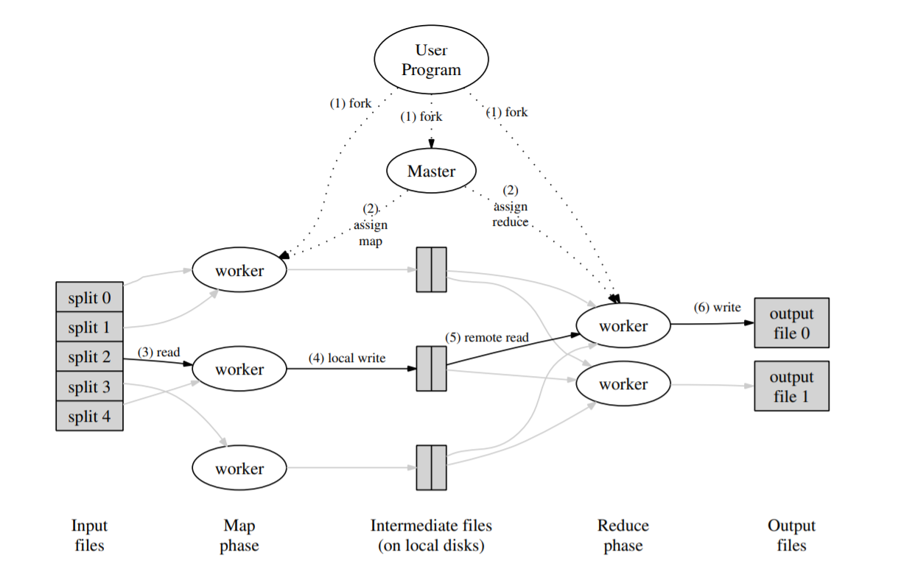

# Lab 1 -  Report

- Student ID: 518021910789

- Student Name: 刘书畅

- Date: 2020/05/08

  


## Part 0: MapReduce 执行过程

首先整理`MapReduce`的完整(分布式)执行过程。




结合代码框架的调用，执行过程可以分为以下步骤：

（以下每题都会针对题目再进行更为详细的代码框架分析）

用户调用`mapreduce`时可以通过参数选择是`Sequential`还是`Distributed`

**Distributed**:

1. 用户会将任务文件分成M份，则会有M个`map task`。用户也会规定有R个`reduce task`。

   用户的代码文件存放在`src/main`下，我们主要使用到的是实现倒排索引的`ii.go`和实现单词计数的`wc.go`

2. 将会有一个`master`线程，其余都是`worker`。`master`负责分配任务，将一个 Map 任务或 Reduce 任务分配给一个空闲的 `worker`。

   分配任务的逻辑由`mapreduce/schedule.go`函数处理。因为`worker`和`master`可能不在一台机器上，所以需要RPC调用，`master`开启一个`RPC server`（`mapreduce/master_rpc.go`）等待`worker`注册（`mapreduce/master.go/Register()`）

3. 对于每一个输入文件都视为一个`map task`，`master`并发分配给一个`worker`调用`domap()`(`common_map.go`)，该函数调用用户定义的`mapF`函数，生成一组键值对，将`key`哈希并对R取模，得到该键值对对应的`reduceTask-ID`,存入中间文件`mapTaskID-reduceTaskID`中。所以总共会生成`M*R`个中间文件。

4. 缓存中的`key/value pair` 通过分区函数分成 R 个区域，之后周期性的写入到本地磁盘上。缓存的 `key/value pair` 在本地磁盘上的存储位置将被回传给 `master`，由 `master` 负责把这些存储位置再传送给 `Reduce worker` 

5. `master`将`reduce task`分配给一个`worker`，调用`doReduce()`(`common_reduce.go`)，该函数处理一个`reduce task`，读取M个中间文件，将相同`key`值的`value`合并，合并后对`key`进行排序。

6. 针对每一个`key`的`value`，再调用一次用户定义的函数`reduceF`，得到所需要的键值对组，最后存入文件`nReduce file`。

7. `master`调用`mr.merge()` （`master_splitmerge.go`）,合并R个`nReduce file`，得到最终结果。

   可以看到`run`函数完整流程为：

   ```go
   schedule(mapPhase)
   schedule(reducePhase)
   finish()
   mr.merge()
   ```

8. 最后`master`给`worker`发送`Shutdown RPC`，最后结束`RPC server`。(`master.go/Distributed`)

   ```go
   func() {
   			mr.stats = mr.killWorkers()
   			mr.stopRPCServer()
   		})
   ```

   

**Sequential**:

顺序的执行`map`和`reduce`。顺序执行是指，只有第一个`map task`完成后，第二个`map task`才开始执行。

整体框架的简化流程为：`run`->`schedule(mapPhase)`->`schedule(reducePhase)`->`finish()
`->`mr.merge()`

Distributed和Sequential的主要区别在于`schedule`函数是否是并发完成任务。


## Part I: Map/Reduce input and output

### 1. 代码框架分析

`master`会对每一个`input file`（也就是每一个`map task`）执行`doMap`函数（`Sequential`情况下直接执行，`Distributed`情况下分配给`worker`执行，见代码`master.go`和`worker.go`）。该函数需要对`input file`执行用户定义的`mapF`操作，接受输入的 `key/value pair` 值，然后产生一个中间 `key/value pair` 值的集合，把所有具有相同中间 `key` 值的中间 `value` 值集合在一起，存储在`intermediate file`。

同理`master`需要对每一个`reduce task`调用`doReduce`函数。该函数调用户自定义的 `reduceF` 函数，接受一个中间 `key` 的值和相关的一个 `value` 值的集合，合并这些 value 值。


### 2. 实验内容

`commom_map.go`文件中的`doMap`函数，和`common_reduce.go`文件中的`doReduce`函数待完善。


### 3. 解决思路 + 核心代码解析

#### doMap

`doMap`函数处理一个`map task`，需要完成以下任务：

1. 将`inFile`读入

   参考 [Go入门指南：文件读写](https://learnku.com/docs/the-way-to-go/122-file-reading-and-writing/3662) 将整个文件的内容读到一个字符串里，可以使用 `io/ioutil` 包里的 `ioutil.ReadFile()` 方法

   ```go
   inputFile, err := ioutil.ReadFile(inFile)
       if err != nil {
           fmt.Fprintf(os.Stderr, "Read file Error: %s\n", err)
   		}
   ```

   

2. 调用用户定义的`mapF`函数处理输入文件，获得一组`key-value`对，存储在`res`中

   ```go
   res := mapF(inFile,string(inputFile))
   ```

   

3. 根据`key`的`hash`值，将`key-value`对存入不同的`intermediate files`

   **中间文件文件名**：总共有`nMap x nReduce `个中间文件，中间文件的文件名通过 `reduceName(jobName, mapTask, r)`函数生成，由于根据`key`值的不同，键值对要存入不同的中间文件，所以`r`值需要通过`key`的值`hash`得到。

   ```go
	hash := ihash(kv.Key)
   r := hash % nReduce
	fn := reduceName(jobName, mapTask, r)
   ```

   **整体解决思路**：遍历一遍所有的键值对，根据`key`的哈希值和``reduceName`函数计算出该键值对所需要存储的中间文件，并将键值对写入文件。因为需要将键值对写入文件的最后，并且文件可能还未创建，参考 [Go入门指南：文件读写](https://learnku.com/docs/the-way-to-go/122-file-reading-and-writing/3662) ，需要以` os.O_RDWR|os.O_CREATE|os.O_APPEND, 0666`模式打开文件。
   
   **文件存储格式**：因为键和值都可能包含` newlines, quotes, and any other character you can think of`，所以用`json`格式将中间键值对存储在中间文件较为合适。根据 [Go入门指南 ：JSON数据格式](https://learnku.com/docs/the-way-to-go/129-json-data-format/3669) , `json.NewEncoder(w io.Writer) `函数返回的 `Encoder` 类型的指针可调用方法 `Encode(v interface{})`，将数据对象 `v `的 `json` 编码写入 `io.Writer w` 中。
   
   具体代码如下：
   
   ```go
   for _, kv := range res {
   
   		hash := ihash(kv.Key)
   		r := hash % nReduce
   		fn := reduceName(jobName, mapTask, r)
   		
   		f, err := os.OpenFile(fn,  os.O_RDWR|os.O_CREATE|os.O_APPEND, 0666)
   		if err != nil {
   			fmt.Fprintf(os.Stderr, "open mrtmp.xxx file err : %s\n", err)
   			continue
   		}
   
   		enc := json.NewEncoder(f)
   		errr := enc.Encode(&kv);
   		if errr != nil {
   			fmt.Fprintf(os.Stderr, "encode json err : %s\n", err)
   			continue
   		}
   		f.Close()
   	}
   ```


#### doReduce

`doReduce`函数处理一个`reduce task`，将中间文件的键值对读入并合并，需要完成以下任务：

1. 将中间文件以`JSON`格式读入，并合并`key`值相同的`value`

   类似于`doMap`函数，使用`json.NewDecoder`函数，`dec.Decode`函数读入键值对，目标文件名通过`reduceName`函数计算得到。

   由于会有`key`值相同的键值对，所以需要使用` append`函数将`value`加入原先键值对

   ```go
   kvs[kv.Key] = append(kvs[kv.Key], kv.Value)
   ```

   

2. 根据`key`值进行排序

   ```go
   for k := range kvs {
   		keys = append(keys, k)
   	}
   	sort.Strings(keys)
   ```

   

3. 按序对每一个中间键值对调用用户定义的`reduceF`函数，得到`reduceValue`，并将结果键值对以`JSON`格式写入目标文件

   ```go
   enc := json.NewEncoder(outfd)
   	for _, k := range keys {
   		reducedValue := reduceF(k, kvs[k])
   		enc.Encode(KeyValue{Key: k, Value: reducedValue})
   	}
   ```

   


## Part II: Single-worker word count

### 1. 代码框架分析

为了使用`Map/Reduce library`，用户需要提供输入文件`input file`，`map`函数分析输入文件，产生中间 `key/value pair` 的集合，和`reduce`函数，处理中间`key`和相应`value`的集合。`doMap`和`doReduce`分别调用用户定义的`map`函数和`reduce`函数。


### 2. 实验内容

完善`wc.go`文件中的`mapF`和`reduceF`函数，完成词数统计功能，计算文档中每个单词出现的次数。


### 3. 解决思路 + 核心代码解析

#### mapF

根据 [MapReduce paper](http://research.google.com/archive/mapreduce-osdi04.pdf),`mapF`函数需要拆分文档中的所有单词，遍历所有单词，对于每一个单词`word`生成一个键值对`<word,"1">`。

`mapF`接收文件名和文件内容，返回`mapreduce.KeyValue`的数组。

**判断是否是单词**：

根据文档提示，需要用`unicode.IsLetter`函数，判断是否为单词

```go
f := func(c rune) bool {
		return !unicode.IsLetter(c)
	}
```

**切分文档为单词**：

根据文档提示，[strings.FieldsFunc](https://golang.org/pkg/strings/#FieldsFunc) 可以将字符串切分为单词

```go
ws := strings.FieldsFunc(contents, f)
```

该函数在满足函数`f`处的位置进行切分，返回切分单词的数组

**生成结果键值对集合**：

```go
for _, w := range ws {
		kv := mapreduce.KeyValue{Key: w, Value: "1"}
		res = append(res, kv)
	}
```

遍历所有单词，对于每一个单词`word`生成一个键值对`<word,"1">`


#### reduceF

因为需要统计文档中的各个单词的出现次数，当单词出现一次时，`mapF`函数就会产生一个`<word,"1">`键值对，意为该单词出现次数加一。`reduceF`需要将同一单词的出现次数相加得到单词出现总数，也就是接收`key`和`key`对应的`value`的集合，该集合为若干个1。所以`reduceF`函数需要遍历`value`累加得到结果，并且返回。

**字符与整型转换**：

由于存入文件的均为字符，所以`reduceF`函数需要通过` strconv.Atoi`函数将`value`中的字符转化为整型再相加。同理返回类型为`string`，最后要使用`strconv.Itoa`函数将结果转化为字符串。

```go
	res := 0;
	for _, num := range values{
		n, err := strconv.Atoi(num)
		if err != nil {
			fmt.Printf("Reduce err %s\n", err)
			continue
		}
		res += n
	}

	return  strconv.Itoa(res)
```


## Part III: Distributing MapReduce tasks

### 1. 代码框架分析

`Map/Reduce`的最大特点就是可以自动将任务并行执行，提高效率，而调用者无需写并行相关的代码。

提供的代码框架实现支持两种操作模式，顺序`Sequential()`和分布式`Distributed()`。`Sequential()`，`map`每次执行一个任务，且依次执行，当所有map任务完成后，`reduce`任务再依次运行。`Distributed()`模式运行许多 `worker` 线程，`master`将任务分配给`worker`，线程并行执行`map`任务，执行完任务后执行 `reduce` 任务。最后合并文件，向`worker`发送`Shutdown RPC`。


### 2. 实验内容

完成`schedule.go`文件的`schedule()`函数。该函数给`worker`分配`map`或者`reduce`任务，使任务被并行执行，等待所有任务被执行完成后返回。


### 3. 解决思路 + 核心代码解析

**整体思路**：可以遍历所有任务，对于每个任务的执行创建一个协程，并发执行，执行任务通过RPC调用，将任务分配给空闲的`worker`。最外面使用`sync.WaitGroup`等待所有协程结束。

**通道(channel)**：可以通过通道在协程之间通信，可以避开内存共享导致的问题；通道的通信方式保证了同步性。数据通过通道：同一时间只有一个协程可以访问数据：所以不会出现数据竞争。因为有些`worker`在`schedule`函数被调用之前就存在，有些`worker`在在`schedule`函数在运行的时候才启动，`forwardRegistrations`函数会把所有注册的`worker`传递给通道`registerChan`。所以在`schedule`函数中接收通道`registerChan`，所有已注册的`worker`将会被`registerChan`传递。

**并行执行：**根据 [Go入门指南：并发、并行和协程](https://learnku.com/docs/the-way-to-go/141-concurrency-parallel-and-co-process/3685)，协程通过使用关键字 `go` 调用（或执行）一个函数或者方法来实现。根据 [sync.WaitGroup](https://golang.org/pkg/sync/#WaitGroup) ，可以使用`sync.WaitGroup`等待所有协程结束。注意每一个`worker`完成任务后需要`wg.Done()`并写回`registerChan`。

**RPC调用**：`schedule`函数需要`worker`执行任务（map或者reduce），所以需要rpc调用，根据文档，可以使用`mapreduce/common_rpc.go`中的`call()`函数给`worker`发送rpc请求，第一个参数为

`worker`的地址，第二个参数为`"Worker.DoTask"`，第三个参数为`DoTaskArgs structure`，最后一个参数表示reply，需要设为nil。

代码入下：

```go
var wg sync.WaitGroup
	for i := 0; i < ntasks; i++{
		wg.Add(1)
		go func(number int){
			args := new(DoTaskArgs)
			args.JobName = jobName
			args.File = mapFiles[number]
		
			args.Phase = phase
			args.TaskNumber = number
			args.NumOtherPhase = n_other

			worker := <- registerChan
			call(worker, "Worker.DoTask", args, new(struct{}))

			wg.Done()
				// 再写回利用
			registerChan <- worker
		}(i)
	}	
	wg.Wait()
```


## Part IV: Handling worker failures

### 1. 代码框架分析

`Part IV`在`Part III`的基础上实现。由于调用RPC`worker`可能会`failed`，返回`false`。`master`需要再次给`worker`分配该任务，直到成功完成。

`RPC failure`并不意味着`worker`没有执行任务，也可能是`worker`成功执行后，返回RPC的时候超时了。


### 2. 实验内容

在`schedule`函数中处理`worker`failed的情况。


### 3. 解决思路 + 核心代码解析

在处理任务时再加一层循环，直到RPC调用的返回为`ok`时才能跳出，否则不断循环调用RPC。

代码如下：

```go
for {
			worker := <- registerChan
			ok := call(worker, "Worker.DoTask", args, new(struct{}))

			if ok == false {
				fmt.Printf("RPC %s error\n", worker)
			}
			if ok  {
				wg.Done()
				// 再写回利用
				registerChan <- worker
				break
			}
```


## Part V: Inverted index generation (OPTIONAL)

### 1. 代码框架分析

类似`Part II`,使用`mapreduce`完成`inverted index`。

倒排索引，被用来存储在全文搜索下某个单词在一个文档或一组文档的存储位置的映射。举个例子，下面是要被索引的文本：

- $T_0$:`"it is what it is"`
- $T_1$:`"what is it"`
- $T_2$:`"it is a banana"`

我们就能得到下面的反向文件索引：

```
 "a":      {2}
 "banana": {2}
 "is":     {0, 1, 2}
 "it":     {0, 1, 2}
 "what":   {0, 1}
```

为了使用`Map/Reduce library`，用户需要提供输入文件`input file`，`map`函数分析输入文件，产生中间 `key/value pair` 的集合，和`reduce`函数，处理中间`key`和相应`value`的集合。`doMap`和`doReduce`分别调用用户定义的`map`函数和`reduce`函数。


### 2. 实验内容

实现`main/ii.go`中的`mapF`和`reduceF`函数，完成倒叙索引的功能。


### 3. 解决思路 + 核心代码解析

#### mapF

需要读取文档，将文档中的单词作为 key，单词所在的文档作为 value，产生一个键值`<word,document ID>`，写入到中间文件中。

切分文档为单词，判断是否是单词这两步和`Part II`相同，生成结果键值对集合的代码如下：

```go
for _, w := range ws {
		kv := mapreduce.KeyValue{Key: w, Value: document}
		res = append(res, kv)
	}
```


#### reduceF

需要读取中间文件，按照键值对进行排序，将 key 相同的数据合并到一起，将单词出现的文件名拼接在一起，生成键值对`<word,list(document ID)>`写入到结果文件中。

根据要求，生成的结果文件的格式需要为：`单词名+：+文档数量+文档名1,文档名2,...文档名n`

我使用`bytes.buffer`存储`文档名1,文档名2,...文档名n`。`bytes.buffer`是一个变长的 buffer，具有 Read 和Write 方法。

由于map不会考虑重复，所以`list(document ID)`中可能会存在重复的`document ID`，所以需要一个`map`存储已经存在的`document ID`。

由于最后一个文档名后面不需要逗号，所以需要`strings.TrimRight`函数去掉最后的逗号。

代码如下：

```go
var fileList bytes.Buffer

	isExist := make(map[string]struct{})
    sum := 0
	for _, document := range values{
		if _,ok := isExist[document];!ok{
			isExist[document] = struct{}{}
			sum += 1
			fileList.WriteString(document)
			fileList.WriteString(",")
		}
	}

	return  strconv.Itoa(sum) + " " + strings.TrimRight(fileList.String(), ",")
```

