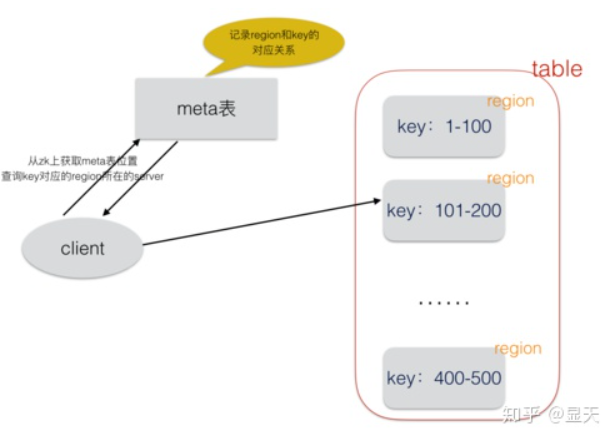

# 表格存储

## Luckysheet

前后端交互：https://www.cnblogs.com/DuShuSir/p/13857874.html

表格操作： https://mengshukeji.github.io/LuckysheetDocs/zh/guide/operate.html#%E8%A1%8C%E5%88%97%E6%93%8D%E4%BD%9C

* 后端采用mongdb数据库

* 删除插入行列都是需要遍历每一个单元
* 格修改rowid等
  * 改进：可以再加一层映射 rowid-真实行号
  * 问题：存成文件后怎么定位一个单元格

## Hbase

hbase是用zookeeper实现的分布式数据库，是基于HDFS实现的

https://www.tutorialspoint.com/hbase/hbase_overview.htm

https://zhuanlan.zhihu.com/p/42776873

把每个表格拆分成不同的region (有点像GFS的chunk?)

(r,c,v) -> metadata = region + server

(LSM: region不单单是一个文件，它是由一个memstore和多个storeFile组成（storeFile上的上限可以配置）。插入数据时首先将数据写入memstore，当memstore大小达到一定阈值，将memstore flush到硬盘，变成一个新的storeFile。flush的时候会对memstore中的数据进行排序，压缩等操作。可以看到单个storeFile中的数据是有序的，但是region中的storeFile间的数据不是全局有序的)

 

